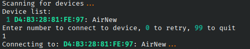

# python-air

Python SDK for communicating with the Sniff Controller Air of Sniff Logic

## Usage

Install the module using `pip`

```
pip install git+https://github.com/snifflogic/python-air
```

to run the example, run

```
python -m snifflogic_air.example
```

To use in your own project,

```
from snifflogic_air import *

```

And then you can use `Air` and `DataPoint` as shown in `example.py`

## Example script

The example is in `example.py`. The script scans for ble devices and presents a list of Airs.
Choose the device number you wish to connect to. The script will then retrieve the battery level and sample rate, modify the sample rate, acquire 5 seconds of data, and print it. It will also change the name (visible only after disconnecting and rescanning).



## Files

- `air.py` - represents the Air device.
- `datapoint.py` - represents a single data point acquired by the Air, including both the breathing and accelerometer data.
- `example.py` - a script demonstrating how to use the Air and DataPoint classes

## Class APIs

### class Air(builtins.object)

Air(address: str) -> None

Class for communicating with the Sniff Controller Air

#### **init**(address: str) -> None

Create a new Air with the given address
Args:  
 address (str): the Bluetooth address of the air,  
 as a hex string separated by colons, e.g. `72:29:35:7E:8E:70:`

#### async change_name(self, newName: str)

Changes the name of the Air so that subsequent BLE scans will see it with a different human-readable name.  
 The address is not affected by this change. In order to see the changem it is necessary to disconnect and scan again.  
 IMPORTANT! In order to preserve compatibility with our software, the name MUST start with 'Air'.  
 Also, The total length of the name must be no more than 8 characters.

Args:
newName (str): New name of Air

Raises:  
 Exception: if name doesn't start with `Air` or is too long.

#### async connect(self)

attempt to connect to the air. may raise an exception of cannot connect.

#### async disconnect(self)

Disconnects from the air

#### async get_battery(self) -> int

Reads the battery level of this Air in percent.

Returns:  
 int: battery level in percent.

#### async get_frequency(self) -> int

Reads the sampling rate (frequency) of this Air in Hz

Returns:  
 int: sampling rate in Hz

#### print_all_characteristics(self)

Prints out all the services and characteristics of the Air

#### async set_frequency(self, newFreq: int) -> None

Sets the sampling rate of this Air.  
 IMPORTANT! currently the Air supports 6 or 15 Hz only.

Args:  
 newFreq (int): new Fequency, must be 6 or 15

Raises:
Exception: if newInt is not 6 or 15

#### async subscribe(self, notification_handler: Callable[[bleak.backends.characteristic.BleakGATTCharacteristic, bytearray], Optional[Awaitable[NoneType]]])

Subscribes to data (breathing and accelerometer)

Args:
notification_handler ([BleakGATTCharacteristic, bytearray], (Awaitable[None] None)]): Function that handles incoming data when it is received.
Use the DataPoint class to parse the incoming data.

#### async unsubscribe(self)

unsubscribe to data

### class DataPoint(builtins.object)

DataPoint(raw_data: bytearray) -> None

class representing a point of data acquired by the air. This includes both
raw and scaled data as well as unscaled accelerometer values.

#### **init**(self, raw_data: bytearray) -> None

Create a new point from raw data received by the Sniff Controller Air

Args:
raw_data (bytearray): byte array received from the air via BLE

#### **str**(self)

String representation of a point. Does not print the raw data only the scaled.

Returns:
str: String representation

## Dependencies

- [`bleak`](https://bleak.readthedocs.io/en/latest/) - for communicating with BLE device
- [`rich`](https://rich.readthedocs.io/en/stable/introduction.html) - for pretty printing.

## Bugs

If you've encountered a bug, please [open an issue](https://github.com/snifflogic/python-air/issues). Include details about your device, operating system, Python version, and Bluetooth version on your computer. Don't forget to attach your code.

## Contribute

Have you implemented something useful that could benefit others? Don't hesitate to submit a pull request.
